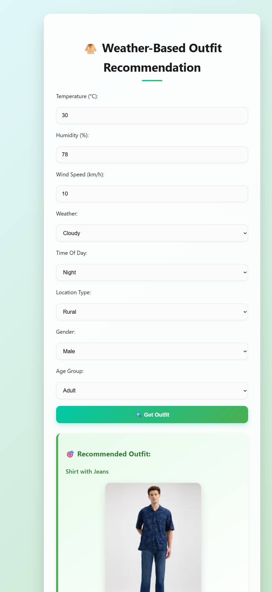
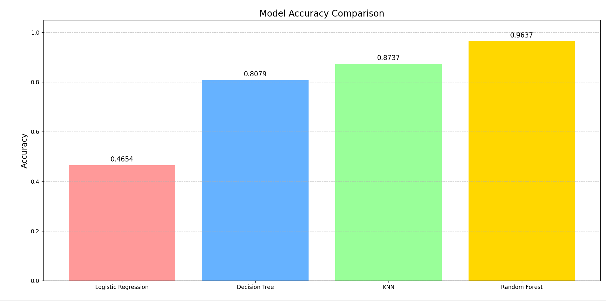

# Weather-Based Outfit Recommendation System

## 📌 Project Overview

A smart machine-learning based system that recommends suitable clothing to users based on current weather conditions, temperature, gender and age group. It combines data-driven classification algorithms with an intuitive ReactJS frontend and a Flask backend to deliver personalized outfit suggestions.

## 🎯 Objective

* Provide accurate outfit recommendations based on real-time weather inputs.
* Utilize machine learning algorithms to classify best-suited outfits for different demographic categories.
* Improve user convenience in deciding what to wear.

## 🔧 Features

* Input parameters: Temperature, Weather condition (Sunny, Cloudy, Rainy, Windy), Gender (Male/Female), Age Group (Child, Adult, Senior).
* Predict ideal outfit class using trained ML model.
* ReactJS user interface with images representing each outfit.
* Flask API for prediction requests.
* Dynamic mapping of outfit names to corresponding images.

## 🛠️ Tech Stack

| Layer            | Technology                                                                                   |
| ---------------- | -------------------------------------------------------------------------------------------- |
| Frontend         | ReactJS                                                                                      |
| Backend          | Flask                                                                                        |
| Machine Learning | Python (scikit‑learn)                                                                        |
| Encoding         | OrdinalEncoder, LabelEncoder                                                                 |
| Algorithms Used  | Logistic Regression, K‑Nearest Neighbors, Decision Tree Classifier, Random Forest Classifier |

## 📂 Dataset Details

> **Note:** This is a *synthetic dataset* created specifically for academic and research purposes. All values are generated based on publicly available weather standards and common outfit practices. It contains no personal or sensitive real‑world data, so it is completely legal and ethical to use for experimentation and machine learning prototyping.

* Total records: 1500
* Features collected: **Temperature (°C)**, **Weather Condition** (Sunny, Rainy, Cloudy, Windy), **Gender**, **Age Group**.
* Target label: **Recommended Outfit**.
* Class distribution: multiple outfit classes including T-shirt, Jacket, Sweater, Raincoat, Shorts, etc.
* Preprocessing included fixing weather terminology (Winter → Windy) and encoding categorical features.

## 🧠 Machine Learning Workflow

1. **Data Collection & Preprocessing**

   * Weather dataset containing temperature, weather condition, gender, age group and recommended outfit.
   * Replaced “Winter” climate category with **Windy**.
   * Encoded categorical features using **OrdinalEncoder**.
   * Encoded target outfit labels using **LabelEncoder**.
2. **Model Training & Comparison**

   * Trained multiple classification models.
   * Compared performance to select best performing classifier.
3. **Prediction Logic**

   * Final model predicts outfit name based on input features.
   * Backend returns prediction and corresponding outfit image is displayed on frontend.

## 📦 Installation & Setup

```bash
# Clone the repository
$ git clone <repo-url>
$ cd weather-outfit-recommendation

# Backend Setup
$ cd backend
$ python -m venv venv
$ source venv/bin/activate  # Windows: venv\Scripts\activate
$ pip install -r requirements.txt
$ python server.py  # (prediction handled in prediction.py)

# Frontend Setup
$ cd ../frontend
$ npm install
$ npm start
```

## 🖼️ UI Preview

Here's a screenshot of the actual frontend interface:



## 🚀 Usage

1. Run backend (Flask server).
2. Run frontend (React app).
3. Enter weather, temperature, gender and age group.
4. Submit to receive recommended outfit and view image.

## 📊 Results & Visualization

### 🔥 Correlation Heatmap


### 📈 Model Accuracy Comparison



Images are stored in the `frontend/Assets/` folder and used in the README via relative paths:

* `frontend/Assets/correlation_heatmap.png`
* `frontend/Assets/model_accuracy_chart.png`
* `frontend/Assets/ui_screenshot.png`

Ensure these paths remain correct when pushing to GitHub so the images render properly.

## 📁 Project Structure

```
weather-outfit-recommendation/
├─ backend/
│  ├─ server.py
│  ├─ prediction.py
│  └─ feature_categories.pkl
│  ├─ feature_columns.pkl
│  ├─ outfit_feature_encoder.pkl
│  ├─ outfit_label_encoder.pkl
│  └─ outfit_predictor.pkl
├─ frontend/
│  ├─ src/
│  │  ├─ components/
│  │  │  ├─ OutfitForm.js
│  │  │  └─ OutfitForm.css
│  └─ public/images/
└─ README.md
```

## 🙌 Future Enhancements

* Integrate real-time weather API to auto-fetch inputs.
* Add seasonal accessory recommendations (e.g., umbrella, scarf).
* Build support for more age/gender categories.

## 📄 License

Distributed under MIT License.

---

**Developed by Ashutosh Pandey (Weather-Based Outfit Recommendation System Project)**
